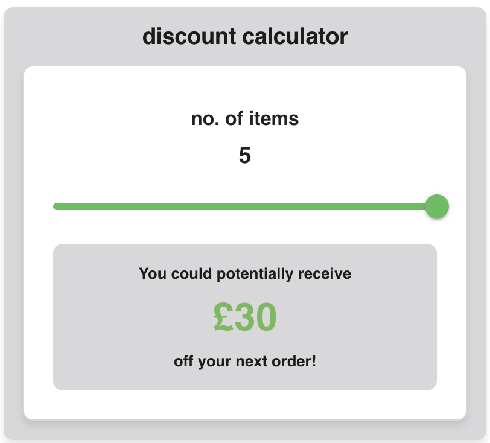

# Batch discount calculator

**Overview**

The Batch Discount Calculator is a proposed feature for the product return flow for Birl. This feature allows users to calculate potential discounts based on the number of items they wish to trade in.

**Features**

- Dynamic Discount Calculation: Users can input the number of items they want to trade in, and the calculator displays the corresponding discount they could potentially receive
- Customizable Discounts: While currently hardcoded, the feature can be developed to retrieve discount data dynamically through an API call. This would enable each shop to customize discounts

**How It Works**

***User Input***: The user specifies the number of items they are returning
***Discount Display***: Based on the number of items, the calculator shows the potential discount amount
***Future Enhancements***:

 - Integration with a backend API to fetch and update discount data per store
 - Add "Item condition" input which could also influence the discount amount
 - Add information/terms popup modal which can inform the buyer about any reasons why they may not achieve the full discount (product condition/product type, etc.)
 - Customizable styles: the theme could be provided from a higher level component in order to enable whitelabeling and advanced styling